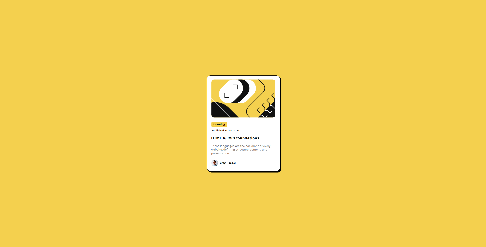
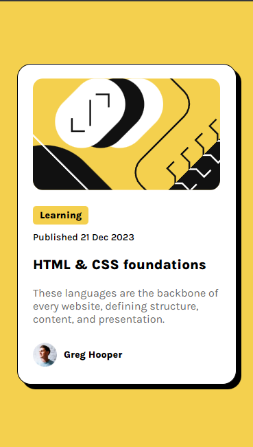

# Este é um desafio do Frontend Mentor - Blog preview card solution

Esses desafios servem para o estudo e auto aprimoramento nas habilidades de desenvolvimento Front-End.

## Aprendizado para o Desenvolvimento do projeto

- Estruturação básica com HTML.
  - Estilização básica com CSS.
  - Uso do Flexbox
  

## Visão geral

### Aprendizado com esse desenvolvimento

Este foi um desenvolvimento de um projeto simples de baixa complexidade.

Por se tratar de um elemento único central, a necessidade do Flexbox foi para centralizar o card, a necessidade do uso do media Query para a responsabilidade Mobile, foi baixa também, diminuindo somente os elementos para comportar na tela do usuário.

Acesse o projeto, clicando neste link: https://iagooliveiraf.github.io/Preview_Blog_Card/

## Screenshot

###  Versão Desktop

###  Versão Mobile

